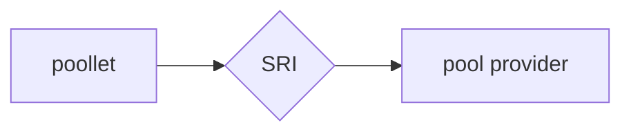
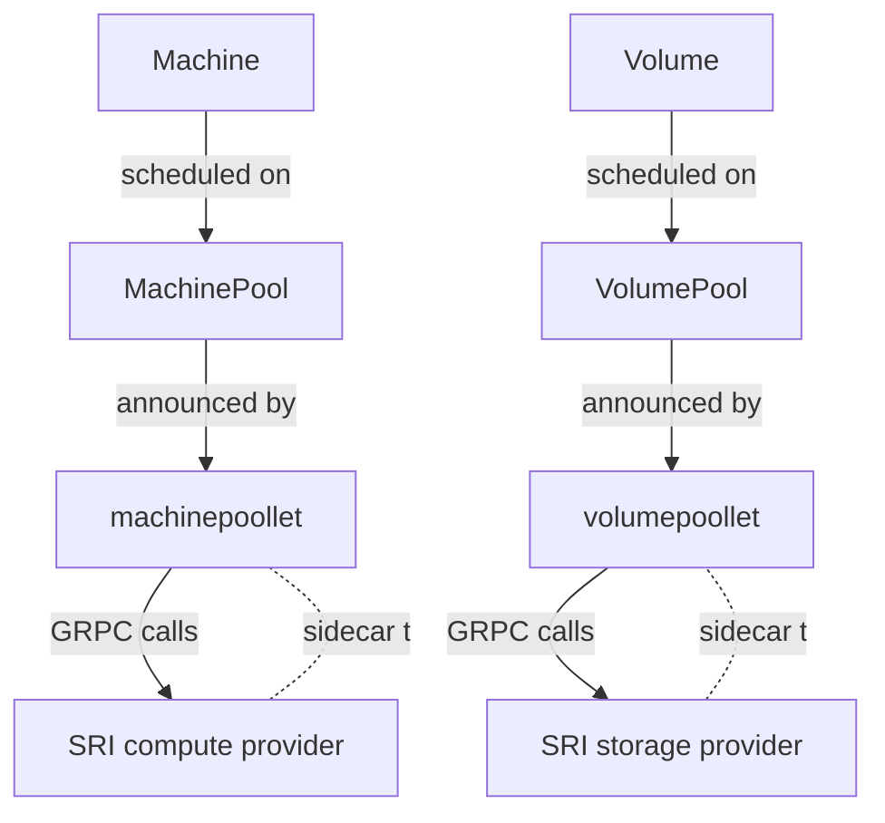

# SRI - Spheric Runtime Interface

## Introduction

The Spheric Runtime Interface (SRI) is a GRPC-based abstraction layer
introduced to ease the implementation of a `poollet` and `pool provider`. 

A `poollet` does not have any knowledge how the resources are materialized and where the `pool provider` runs.
The responsibility of the `poollet` is to collect and resolve the needed dependencies to materialize a resource.

A `pool provider` implements the SRI, where the SRI defines the correct creation and management of resources 
handled by a `pool provider`. A `pool provider` of the SRI should follow the interface defined in the
[SRI APIs](https://github.com/spheric-cloud/spheric/tree/main/sri/apis). 

## `pool provider`

A `pool provider` represents a specific implementation of resources managed by
a Pool. The implementation details of the `pool provider` depend on the type of
resource it handles, such as Compute or Storage resources.

Based on the implementation of a `pool provider` it can serve multiple use-cases: 
- to broker resources between different clusters e.g. [volume-broker](https://github.com/spheric-cloud/spheric/tree/main/broker/volumebroker)
- to materialize resources e.g. block devices created in a Ceph cluster via the [cephlet](https://github.com/spheric-cloud/cephlet)

## Interface Methods

The SRI defines several interface methods categSRIzed into Compute, Storage,
and Bucket.

- [Compute Methods](https://github.com/spheric-cloud/spheric/tree/main/sri/apis/machine)
- [Storage Methods](https://github.com/spheric-cloud/spheric/tree/main/sri/apis/volume)
- [Bucket Methods](https://github.com/spheric-cloud/spheric/tree/main/sri/apis/bucket)

The SRI definition can be extended in the future with new resource groups.

## Diagram

Below is a diagram illustrating the relationship between `poollets`,
SRI, and `pool providers` in the `spheric` project.

This diagram illustrates:

- `Machine` resources are scheduled on a `MachinePool` which is announced by the `machinepoollet`.
- Similarly, `Volume` resources are scheduled on a `VolumePool` which is announced by the `volumepoollet`.
- The `machinepoollet` and `volumepoollet` each have an SRI `provider` sidecar, which provides a GRPC interface for 
making calls to create, update, or delete resources.
- The SRI `provider` (Compute) is a sidecar to the `machinepoollet` and the SRI `provider` (Storage) is a sidecar to the 
`volumepoollet`. They handle GRPC calls from their respective `poollets` and interact with the actual resources.
